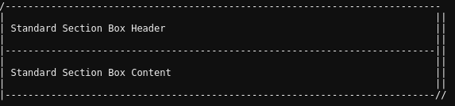

# Artisan Format

[](LICENSE.md)

Format Laravel Artisan command output.

## Requirements

This package requires:

- PHP >= 7.0.0
- Laravel >= 5.5

## Installation

Install the package via Composer:

``` bash
composer require tfhinc/artisan-format
```

The package will be found via auto discovery. You may also add the service provider in `app/config.php`:

``` php
TFHInc\ArtisanFormat\ArtisanFormatServiceProvider::class,
```

Publish the `artisan-format.php` configuration file to your Laravel config directory:

``` bash
php artisan vendor:publish --provider="TFHInc\ArtisanFormat\ArtisanFormatServiceProvider"
```

## Usage

Artisan Format provides a series of Traits that can be used within your Artisan command classes.

- [Sections](#sections)

### Sections

The Sections trait produces distinct sections of text in your command output.

Include the `ArtianFormatSections` trait in your command class:

``` php
use TFHInc\ArtisanFormat\Traits\ArtisanFormatSections;

class Run extends Command
{
    
    use ArtisanFormatSections;
```

Generate a Section with a Header and Content:

``` php
$this->sectionBox('Standard Section Box Header', 'Standard Section Box Content');
```

Output:



## To Do

- Finish Readme

## License

The MIT License (MIT). Please see [License File](LICENSE) for more information.
